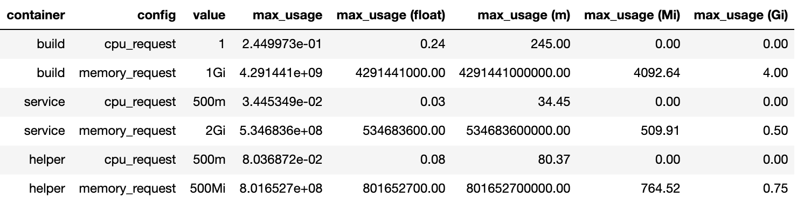
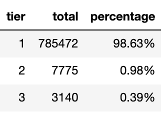
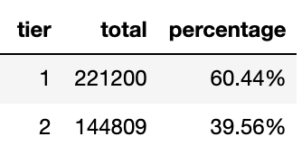
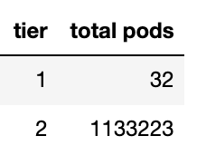
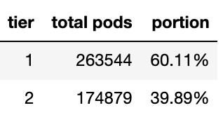

First of all, let's begin with talking about the kind of workloads we have. We have 3 kubernetes clusters hosting gitlab runner workloads. These workloads are a bit unique. They are not microservices. What makes them different from microservice workloads is that they only run scripts performing specific tasks, and when they're done, they'll be terminated immediately. They're just jobs. They only run for like less than 5 minutes. But they're so many of them. There are approximately 1.5k jobs pods spawned in all clusters on daily basis. They're ranging between 1k to 4k during workdays.

Initially we treated our runner specs like microservices specs. There would be like 500m cpu request with 1 core cpu limit and 500Mi memory request with 1Gi memory limit for all containers. Though some runners were configured with big numbers, but in general they were weighing on slightly identical specifications.

We knew this specs had been around for a while, optimizing runner job pods configurations was on our radar.

At first, we came up with a very radical kind of move and we were very confident with our plan. We were very cautious with the ramifications of what we wanted to do. Frankly, we didn't know that our plan would turn into a catastrophic disaster 😂. I'll tell you what happened later.

Our first move was decreasing the specs of all our runners. We didn't bluntly come up with certain numbers. We made use of our runner monitoring data. We collected a plenty amount of 2 weeks containers cpu and memory profiles of our runner pods.

## Gauging on Value Distribution

We begin our investigation with the notion of finding underutilized runners. We embarked on an assumption that the 10% pods population was the outlier, they only happened for specific reasons. They didn't represent the minimum resource of runners needed to perform their tasks.

In order to have a deeper sense of what was going on, we started our evaluation by looking at resource usage distribution. We needed to know how cpu and memory usages quivered from time to time.

We classified our runner pods cpu profiles into 5 groups and we calculated the total pods proportion of each groups. We had our data shaped like in this table.


When we saw this table, we kind of shocked because the cpu consumption distribution wasn't like what we had thought of before. It turned out that the amount of pods in the 10% resource population was huge. Insisting to use this methodology would bring numbers of pods dreadfully suffer from cpu insufficiencies. This proposition didn't work in our condition.

## Respecting Outliers

With the insight we brought from resource usage distribution, we took a more simpler approach to determine cpu and memory requests. We ranked pods resources usages and pulled out the maximum value then we made a comparison between the maximum utilization and the current configured resource request value for each containers.



The table above shows containers resource specification and their maximum resource usage. The value column is the amount resource configured for the containers, the max_usage column tells us the maximum resource utilization, and the rest columns are the maximum usage value represented in other units.

With this table, we specified the containers resource request by basing on the maximum utilization shown in the max_usage column. If containers resource maximum utilization values surpass the configuration value, we leave the configuration as it is. If the resource maximum values are below the configured value, we change the resource request configuration value to the resource maximum utilization value.

We applied this rule to all containers of all our gitlab runners configurations. We considered the formula was safe enough because containers cpu and memory specifications won't be configured below their maximum actual usages.

Some containers were configured with very tiny values. There were several containers configured down to 50 milicores cpu requests. The configuration numbers were so ridiculous. Imagine how much money we could save with these super infinitesimal configuration values. We then deployed these configurations to production.

At first, everything seemed ok. All jobs were successfully executed and we started preparing for cost evaluation.

Then we received reports from our end users. They told us that recently their pipeline jobs could spend 20 minutes to finish and some jobs were timed out to 1 hour. More users came to us and said the same. And then everybody was like screaming in our support channel. We then decided to revert the configuration to the previous one.

We didn't anticipate that kubernetes throttled our containers cpus. It seemed like this incurred slow tasks executions to our runners. Although this still doesn't make any sense to me until this day because we didn't drop our container configuration limits to less than 500 milicores cpu.

We marked this approach as failed and moved to another workaround. We didn't give up, we knew we still had another plan on the agenda.

## Tiering

This was like bringing new variants of runners like introducing new iphone models with bigger screens, bigger batteries and low end modes with smaller sizes and less pixels which come with a cheaper price in order to bring the sort of accessibility to all levels of markets.

The initial idea was to address intensive resource consuming jobs which deserved runners with high resource specifications and also have economic environmental friendly runners for low resource jobs.

We started our plan by labeling runner jobs pods with repositories id. This was meant to give us information about which repositories that demanded high runner specifications and which repositories supposed to use low runner specs.

We executed this pods labelling and started preparing our strategy for lobbying repositories maintainers. We had 600 services repositories, we knew we didn't have the resources to migrate these repositories runners to use tiered runners with our hands.

A week later we collected pods monitoring data. We began with classifying containers resources utilizations with a basic classification rule. Previously, we had our classifications by anchoring on resources usages distribution values, now we based our classification on a simple rule. We classified resources usages into 3 groups, we called them tiers and the formula looked like this.

```bash
tier 1 = resource_usage <= 0.3 * resource_request
tier 2 = resource_usage > (0.3 * resource_request) && resource_usage <= (0.7 * resource_usage)
tier 3 = resource_usage > 0.7 * resource_request
```

Again, we combined runner configuration data with runner usages data. The formula above means to map runners jobs to which tiers they belong to. And the data looks like this



The table above is the cpu usages captured across time which tells us that there were `98.63%` times cpu usages were below or equal `0.3` of its specified request configuration.

Then we applied the formula to memory requests as well.


The table above means that there were no memory utilized below `0.3` request. There were `79.01%` times memories were used above the `0.7` specified request.

This also means that tiers couldn't be classified into 3 classes because there were no memory usage classified as tier 1. We couldn't let pods got killed because they were out out memory. We decreased the amount of tiers to 2 classes.

```bash
tier 1 = resource_usage <= 1 * resource_request
tier 2 = resource_usage > 1 * resource_request
```

This resulted a delicate proportion. Jobs were distributed 2 tiers.




The 1st table is the cpu tiers and the 2nd is the memory tiers. When we joined the cpu and memory tier tables, our tiering mechanism fell apart. Almost all pods went to tier 2.

Here is the evidence of what made them classified to tier 2. If we look at the table below, this pod shouldn't be classified as tier 1 because it demanded the amount of memory usage on tier 2.


We couldn't have our tiers classified into 4 combinations like tier 1 for cpu tier 2 for memory. We should only have tier 1 for both cpu and memory or tier 2 for both cpu and memory. And if we insisted to use this model, the proportion would look like this.



This won't make any difference with the non tiering runners as most pods are classified as tier 2. And when we went closer to our data, we realized that this was not going to work because we didn't label the name of the jobs. Even though we knew what repositories we would optimize, we didn't know which jobs to address.

## Recalibrate

We wrapped our head around on this issue and started asking what can be done next. We started looking at our pipeline jobs architecture. We realized that when a pipeline runs, it aims for making a deployment.

When we looked at our deployment pipeline scripts, we noticed that these scripts didn't demand a considerable amount of resources as their main job was preparing and running deployments such as configuring manifests and sending curl requests.

To validate our assumption, we ran a deployment job and looked at the cpu profile.


This was like the holy shit moment we had. This was exactly what we were looking for. `0.25` core cpu spike job is the type of jobs that should be handled by low specs runners.

And the benefit of this was that we didn't have to address specifically which repositories needed to use which runner tiers because this type of jobs were defined in our global gitlab ci template. All deployments inherited this template. Introducing changes to this template will automatically disseminate changes to all microservices deployments.

We agreed on this approach that we would only tier runners which were tasked to prepare and run deployment jobs. Even though this seemed quite coherent, we had to measure the impact first before executing our proposal.

## Cost estimation

Remember we didn't have job name label in our pods. We didn't know which jobs were the configuration and deployments jobs that we wanted to address.

When we looked at to our pipeline jobs design, we noticed that production jobs duty was only to run deployments scripts. And when we zoomed in, our pipeline streamed like a waterfall, they flowed in serial and productions jobs which ran on productions runners were the end of the river line.

What does that mean? It means that all pipelines which involved productions runners have to run preproduction dan shared runners first. This what brought us to confidently use samples.

We estimated our runner cost by using random samples with the amount of production jobs to jobs that were run on preproduction and shared runners. Our tiering proportion table became like this.



Then we gathered our GKE bills. We wanted to know how much cost pods spend down to its containers and embarked with an assumption that pods costs were calculated by the amount of requests.

When we divided the costs by the amount of cpu and memory used, every row produced a different cost fraction. We could not use this number, this would into an inconsistent estimation. Luckily, there was a SKU ID column in our GKE bills data. It means that we could find the actual price on public google sku data.

It was a little weird approach but this allowed us to map cost fractions for the non tiered and the tiered resources requests with reliable numbers.


With this data we could easily calculate the estimation by aggregating the current price and the tiered estimated price.

We arrived to the most ridiculous part of working on this project. This data told us that we would make `45.24%` cost reduction with our tiering model. When I presented this to my colleagues, I could not stop laughing. It is impossible that we could reduce our runner cost to that such amount of percentage. This number is too wild.

We tested out our configuration by running end to end pipeline deployments and we didn't experience any concerning execution durations compared to the non tiered runners pipelines.

After a week of tiering runners deployment, we found no report of slow runner performances.

We began to evaluate the tiering runner cost. It was not bad. We made a very substantial amount of cost reduction. We achieved `21.55%` cost reduction on daily basis.

## Desserts

We were over-reacted to the data we had. We inclined to pull several statistical approaches with the provided vast amount of metrics too early. We didn't consider enough our environment. When we took a closer look at our runner architecture, our problem became narrowed by itself and practical solutions began to emerge as if they were falling from the sky.

Labels play an essential role. One of the things that made finding the under utilized runner complicated was that pods weren't labeled with the job name.

Estimating pods price with request value turned out to be a bad idea because google bills kubernetes workloads by the amount resources used. This made our cost estimation invalid. But it was not really a bad move. We made a quick and simple resource calculation by using resource requests configuration and public SKU data.

Overall it was good. We made a significant cost reduction to our workloads without sacrificing their objectives nor even degrading their performance.
