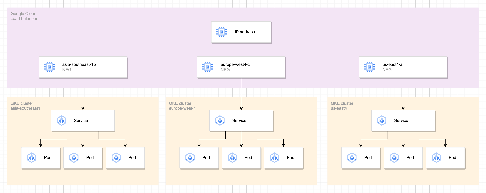

First of all, let’s make a brief preamble about what’s the relation between Google Cloud Load Balancer and Google Kubernetes Engine Cluster. Commonly these two terms are abbreviated to GCLB and GKE.

Let’s start from seeing how these twos operate in pair to bridge clients outside Kubernetes networks to reach out pods. As the public has repeatedly said, it’s the Kubernetes ingress, but what is this ingress?

Here’s how I define it, it is a forwarder which needs a Kubernetes service type LoadBalancer that transmits traffic to services. What is Kubernetes service type LoadBalancer? It’s a Kubernetes service that comes with a load balancer. A load balancer is used by a traffic forwarder to receive network requests coming from outside Kubernetes networks. This traffic forwarder is a set of Kubernetes pod(s).

Yes, we need pods in this network supply chain.

When we have a Kubernetes ingress, there’s a controller behind the curtail acting as a backend whose job is to make servers discoverable to clients by hostnames defined in Kubernetes ingress hosts configuration.

Do we really need Kubernetes ingress to deliver traffic to pods? No, we can use a service type LoadBalancer to make our pods reachable from private or public networks. We cast the same mantra like Kubenertes ingress.

However, we want to have Kubernetes ingress to do this job, otherwise we will end up to have many load balancers to expose individual services.

Back to ingress. For most times, we will use ingress to expose our services. This implies that there is a kind of one to many relationship where an ingress is responsible to be a backend of many services.

This portrays that ingress plays a very critical role. Events occur to this particular part for me is brittle.

A common case, we need to upgrade an ingress controller, and there are some changes included in the newer version. All new behavior will propagate to all services, if there is an unexpected one, all of them will get the hit.

A real case, real one, you might experience this if you have an NGINX ingress controller installation with helm. In a certain chart version, there’s a service name change. This pulls the trigger of a load balancer recreate.

That means the helm upgrade command will remove the current ingress NGINX load balancer then we will have a new load balancer with a different IP address as a result of a new kubernetes service instance. Consequently, we will need to update our ingress DNS record with the new IP address so it can continue to function.

The impact of load balancer recreate is incredibly deleterious but it’s rarely being discussed in a conversation which brings me a wonder. Do we have consented to trade offs of this such cascading failure or is this just invisible to us, we just don’t see it coming.

This thing gets worst, if we don’t have a DNS for our ingress. We’ll be punished with a mountain of works by updating all clients to call the new ingress IP address.

Many ways we can deal with this NGINX chart situation. We can do some tricks such as patching the chart by adjusting the service name to one that is currently used, organizing an NGINX controller migration deploying another installation then we update services ingress to use the new one, and so forth.

Talking about those workarounds are not in my mind, not interested to sequence cards to play when shits hit the fan. Would it be sexier to think about how to let service deletions happen, and do nothing when it occurs but not paying off any ramifications. In short, how to stay cool when Kubernetes services get recreated.

Translating this to our case, how can we design our Kubernetes ingress power source so we won’t capitulate to a brand new load balancer creation and we will avoid a load balancer deletion at the same time despite Kubernetes service updates. Isn’t that a peaceful environment for a crucial front component like ingress controllers.

Let’s delve into how can we achieve this in GKE. We will elaborate how to persist GCLB instances and how to deterministically make Kubernetes services plug in to the GCLB instances we set up.

## Baking The Vertices

We’re going to examine a ubiquitous example. We will make pods accessible from the internet over an NGINX ingress controller. This requires us to have an External Google Cloud Load Balancer.

There are many types of load balancers in GCP. They are distinguished by traffic shapes or characteristics.

We’ve been clear with the scope of traffic we want to have which is public, the next thing to think about is what kind of GCLB backend we need to have.

One of the available backend types we can have is NEG. NEG stands for Network Endpoint Group.

What makes it suit to our case? In order to avoid a load balancer replacement, we’ll have to withdraw GKE from managing it. We don’t want GKE to provision a load balancer, we will create one by ourself instead.

Let’s place emphasis on what is NEG. NEG is not a GCLB instance, but it’s a backend for a GCLB instance.

NEG needs to understand pod IP addresses in order to distribute traffic to correct destinations. Keep in mind, they are not service IP addresses. This type of GCLB backend has a capability of delivering traffic to pods directly without an intermediary like kube-proxy or equivalent technology.

As pods are dynamic, pods are by design able to transcend in the vast sea of beatific nodes. Then who’s in charge of collecting their IP addresses? Do we need to snatch pod IP addresses and bind them to our NEG manually? That would be like catching up with the 5 last PI decimal point.

GKE will be responsible of attaching pod IP addresses to our NEG. How do we make it happen? We only need to annotate our Kubernetes service and GKE will do the job.

```yaml
apiVersion: v1
kind: Service
metadata:
  name: ingress-nginx-controller
  annotations:
    cloud.google.com/neg: '{"exposed_ports": {"443":{"name": "ingress-nginx-controller"}}}'
spec:
	type: ClusterIP
```

Putting this in bold, we’re not creating a service type LoadBalancer, but we have a service type ClusterIP. This way, we’re not delegating GKE to manage a load balancer for us.

Setup one GCLB instance with no backend. The detail of how to create GCLB is available in GCP documentation.

From the Kubernetes service configuration above, GKE will provision an NEG named `ingress-nginx-controller`. Use the GCP web console or gcloud to grab the generated NEG URI. Here’s how to attach the NEG instance to our load balancer backend with terraform.

```bash
resource "google_compute_backend_service" "neg" {
  backend {
    group = "projects/project-id/zones/asia-southeast1-b/networkEndpointGroups/ingress-nginx-controller"
  }
}
```

The backend configuration is where the integration between our GCLB and Kubernetes service takes place.

Zooming out our setup, here's how components look in frame.


Now our Google Cloud Load Balancer and Kubernetes service lifecycles are completely independent. Our components become modular. When we delete our Kubernetes service, our load balancer will stay in place, unshakable.

We can hand off our steer wheel when there’s a Kubernetes service recreate because the new one will be linked to our load balancer backend without a manual intervention.

## A Feasible Region

As a thought experiment, we may want to leverage this setup to surface a bigger challenge which is how to bring our ingress geographically closer to our client locations.

Let’s make a case that we need GKE clusters in other regions because there are some sort of government regulations that we need to comply.

GKE and all other Kubernetes platforms I know are regional. We’ll have to provision clusters in the required regions.

The question is how can we discover our ingress in different cluster regions using one endpoint? Will we need to assign one DNS with all IP addresses of ingress controllers in all given clusters?

That’s one way of doing it. In Cloudflare, we can have this badass capability to configure multiple origins for one DNS. We can kinda let traffic load balancing happen at DNS level.

Another strategy we can adopt is to extend our GCLB backend to bind multiple NEG instances.

Get the same Kubernetes service configuration deployed to individual clusters, then configure all generated NEGs from the given clusters as the backend of our load balancer.

```bash
resource "google_compute_backend_service" "neg" {
  backend {
    group = "projects/project-id/zones/asia-southeast1-b/networkEndpointGroups/ingress-nginx-controller"
  }
  backend {
    group = "projects/project-id/zones/europe-west4-c/networkEndpointGroups/ingress-nginx-controller"
  }
  backend {
    group = "projects/project-id/zones/us-east1-a/networkEndpointGroups/ingress-nginx-controller"
  }
}
```

We now have a single accessible endpoint from the internet that binds to ingress controllers deployed in multi region Kubernetes clusters around the world.



Say the us-east4 GKE cluster got nuked by a terraform destroy, our ingress would continue to serve from the clusters in other regions.
