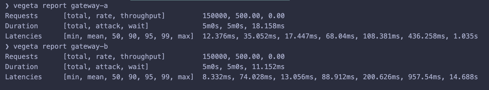
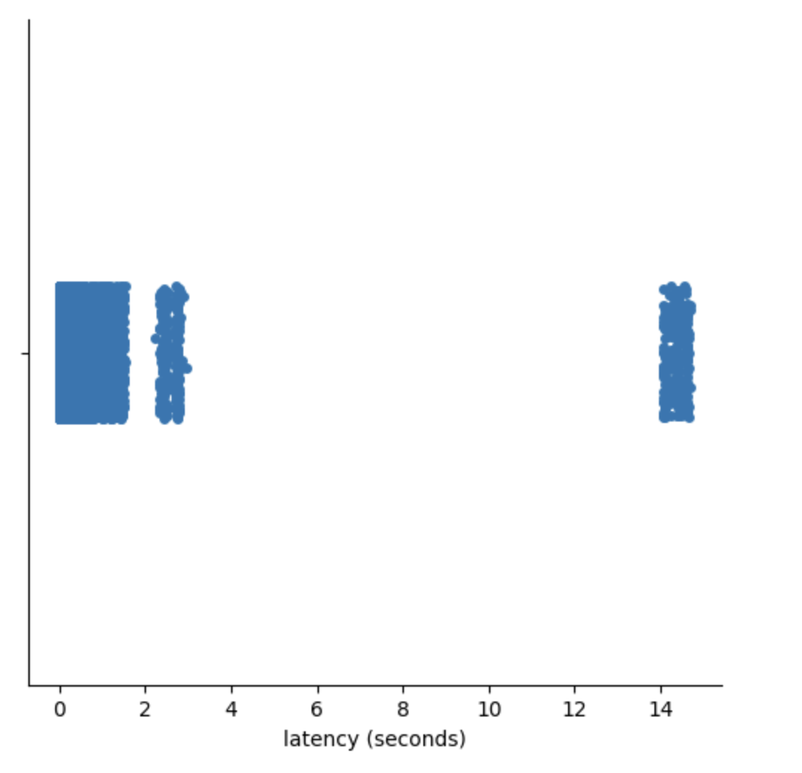
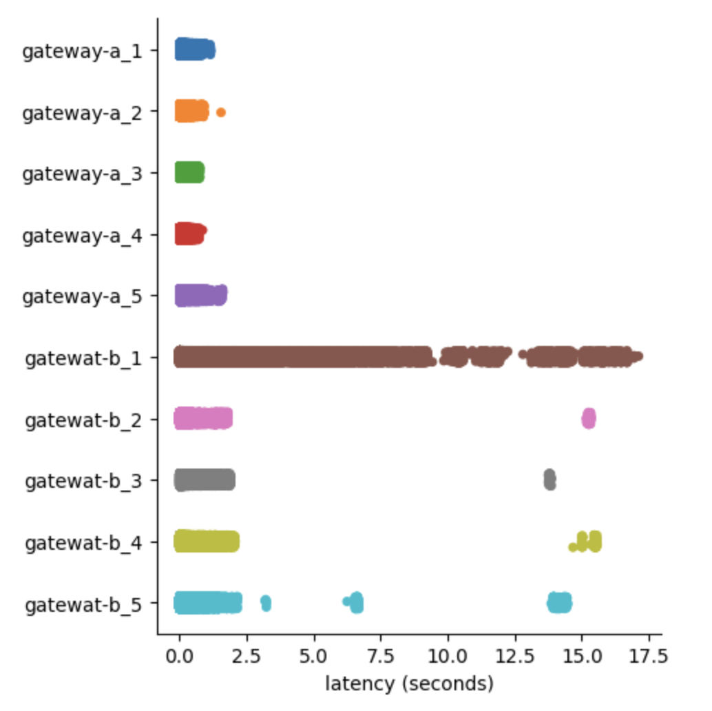

This time, I'm writing a story about my experience in observing latency and performance of two gateway load balancers. It was part of a migration project, it was a time when we needed to pick up a load balancer for our api gateway in a new environment.

Optimistic ideal aims were set in place, like any engineering project wants to be born in every corner of the world, we needed a fast and reliable one.

We started out from the first aim which was to catch the fast one by measuring latency, getting gateways performance profiles, and bringing the numbers side by side.

There were two gateways we examined, argo-a and tunnel-b. It would’ve been fun too if I could present them as ng-a and inx-b. To avoid this writing from a commercial use, let’s go with gateway-a and gateway-b.

We went to our stable tacking our horse with a saddle and stirrups. We got our gateway-a and the gateway-b required components assembled to expose our api gateway deployed in kubernetes. There we were set for the barrel race.

Load testing is dead simple nowadays. We crashed our gateways with an open source tool named vegeta. The best thing is that not only it provides a brief summary of what the latency is looking like, it also accommodates us with raw load test result data in case we want to process the data further with our own tool.

This weapon allowed me to pull latency data and compose a report for my team in a day.



As blind as it could be, coming from the campaign of getting the fastest one, when l looked at this table, my pupils irresistibly went straight to the min values.

Shifting my sighting to the p50, and p90 values, the difference looked so trivial. Hundreds milliseconds won’t put a dent in the scale we had. I tripped over the p99 and the max values, the p99 values were still under milliseconds, they didn’t surpass my tenable threshold.

I said this looked like a quick win for the gateway-b.

However this gateway-b max value was looking a bit pathetic, it was 14 seconds. This looked so terrible for latency.

Recklessly I said but this is a maximum value, this should be an edging case, there would be one to five times out of thousands occurrence. Production should tolerate and relax with it.

I came to draw a conclusion that the gateway-b wins over the gateway-a. With a smile on my face, I locked my screen and slammed it as if I earned a victory, feeling relieved knowing that this work took faster than I had thought of.

By the next day, the 14 seconds thought sneaked back into my mind. It was this voice. “Is it really? Is this really what’s happening? How can this look so easy? How can this feel so wrong?” These questions ran over my head again and again like a creeping Kubernetes CrashLoopBackOff. What the actual duck.

It felt like I was cornered in an empty room. It kept tailing me when I took a shower, when I went for a walk, when I went to a grocery store, at a parking lot, at a national public library, it was all over the place. I couldn’t stop thinking about it.

The force of curiosity invited me to work back at my lab. This time, I wanted to get dirty with the raw data. I had a hunch that there was something lurking behind this appalling number. I needed to find out.

I googled what’s the fanciest jupyter lab way of charting this data, also one attempt to catch up with the latest hot stuff out there. I didn’t expect to arrive at seaborn documentation. I read over several pages, I instantaneously recognized greatness by just looking at what I would need to do to visualize my data.

After hours of scrolling up and down, left and right, saturated with fascination disguised procrastination, I landed on the sns catplot plot, which I found very neat and handy, easy to use.

I managed to get this raw pure rich enzyme visualization in a couple lines. I couldn’t believe it would call me to triage my statistics elementary understanding injury.



For me, this was jaw dropping. This was shocking, the freakin 14s might be like the tip of the iceberg. There were some requests responded above a stretch of my acceptable threshold.

I went from being steadily tenacious to bewilderingly suspicious. This particular finding dispatched a jarring petrifying shameful introspect to me. What does the statistics percentile actually mean?

I went to Wikipedia and I got this fancy [percentile definition](https://en.wikipedia.org/wiki/Percentile).

> In statistics, a k-th percentile, also known as percentile score or centile, is a score below which a given percentage k of scores in its frequency distribution falls ("exclusive" definition) or a score at or below which a given percentage falls ("inclusive" definition).

These words looked like an abstract class with a too broad implementation for me. Suffice to know that I won’t be able to instantiate it, I need to extend and make it meaningful in order to rake its fungible properties in.

How can I map this wikipedia percentile definition to my current circumstance? What does it mean to my data?

Believing like I knew how to do it, I went to assess my thoughts by doing a basic behavioral observation with a brute variable testing. The idea was what if I sampled my data with rudimentary numbers in the shape of my real data in order to excavate the ground.

I went lining up an array of numbers and trying to discern what the p25 and p90 produce. Here’s to demonstrate the percentile calculations.

```python
np.percentile([1,1,2,10], 25)

# 1.0

np.percentile([1,1,2,10], 90)

# 7.600000000000001

```

Given that they result in these numbers, I set out some low numbers to theme them up with my load test data pattern, and it painted its real colors.

```python
np.percentile([1,1,1,1,1,1,1,1,1,1,2,10], 25)

# 1.0

np.percentile([1,1,1,1,1,1,1,1,1,1,2,10], 90)

# 1.9000000000000004

```

This opened up my mind about that If I saw dominating values in low percentiles, and there was a population disparity between low and high percentiles, I would see the values of high percentiles approaching low percentiles.

Translating that to my case, If my load test data was populated with plenty of low latency results which gave me a low number of p25 per say, it shouldn’t be shocking if the p99 would come near to that low number.

Consequently, the given sheer amount of low latencies blitzed the p99 value in a tumbling sense.

It got me thinking, if this was true, would this behave consistently? Was this just a prick of defiance? Would I find it if I do it repeatedly?

I went back performing another test iterations for both gateways harvesting more data in light of purging my assumptions. Here’s the load test plot showing 5 time test iterations for each gateway.



It was alleviating though unfortunate to see this concerning pattern reemerged in other gateway-b test iterations. This was invisible until I pulled the sns cat plot.

It was a kind of working backward, where a visualization quickly helped me out see what was happening in my data, then it lured me into the bottom with statistical percentile observation.

I was really hoping that my hunch was wrong because I had a bias toward gateway-a in the beginning of the work. It would be diabetically sugary sweet if the result aligned with my presupposed idea.

I went on my hunt carefully. I deliberately allocated breaks just because I didn’t want to catch a train of one sided dubious complacent thoughts. What a very dangerous path to be on.
