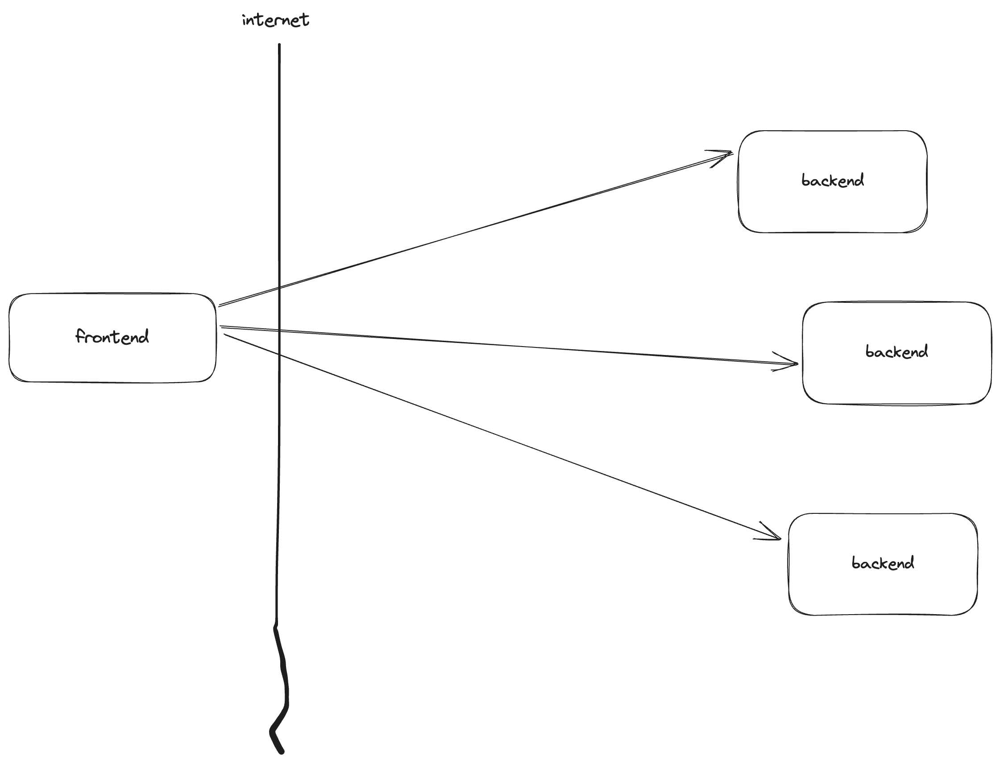
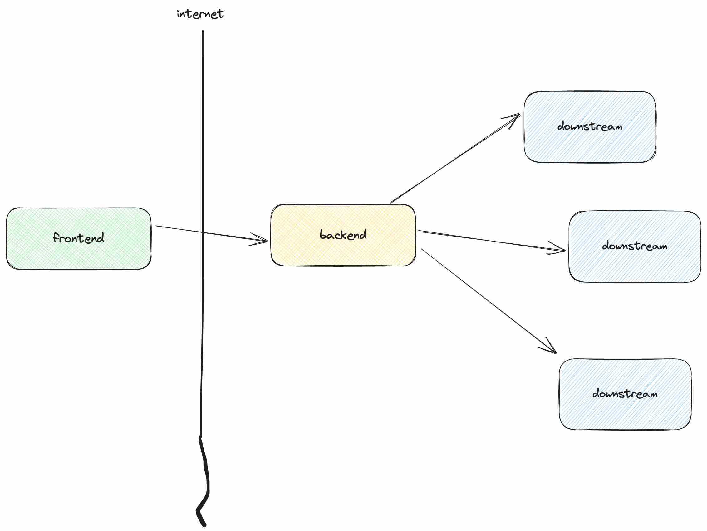
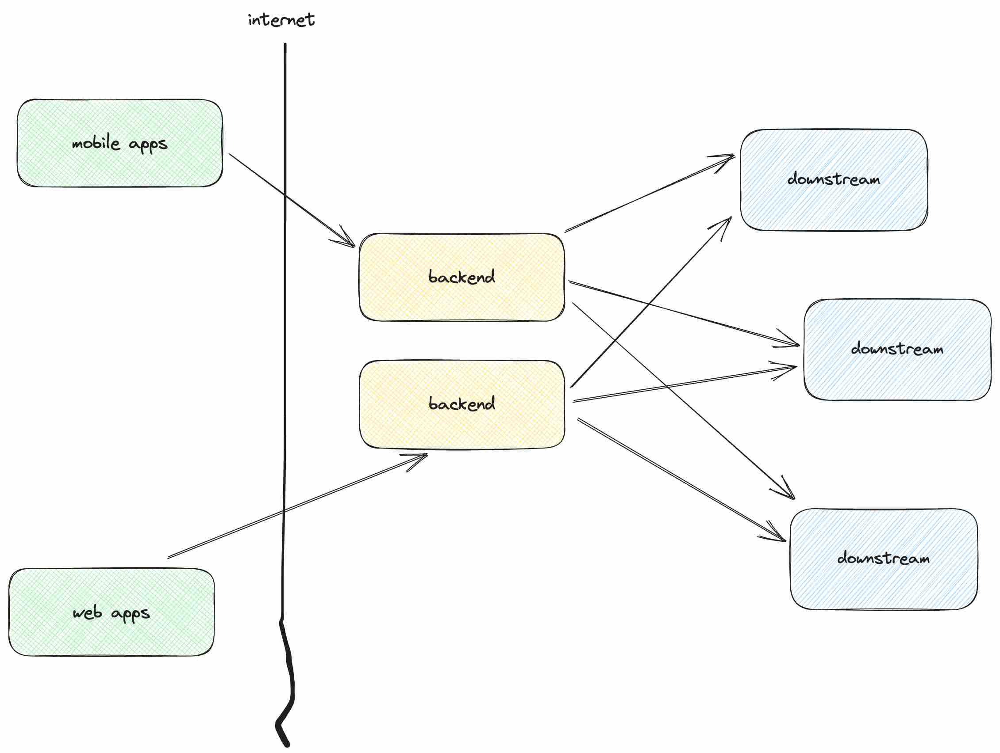
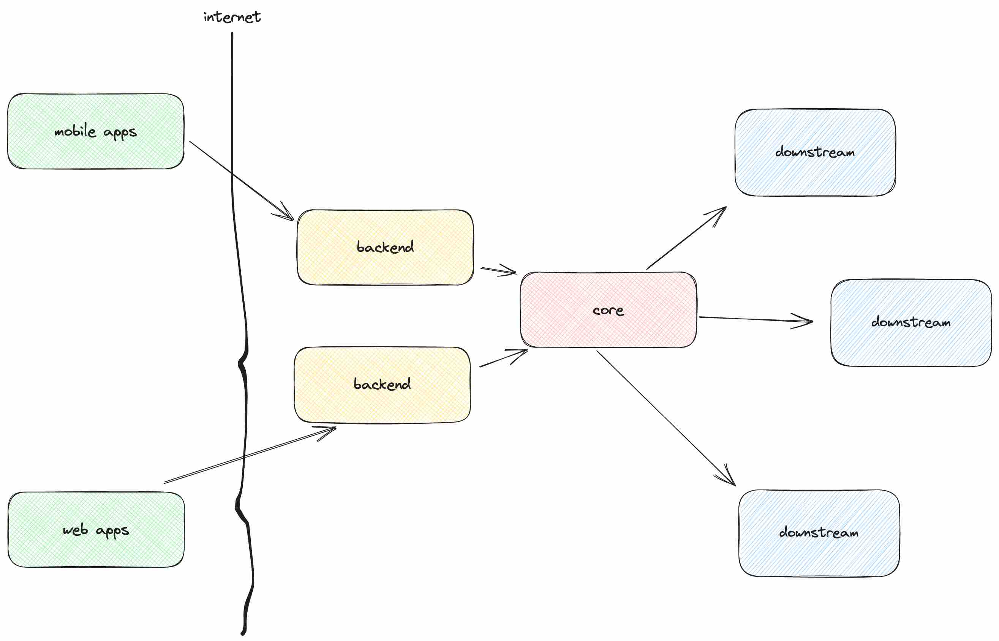
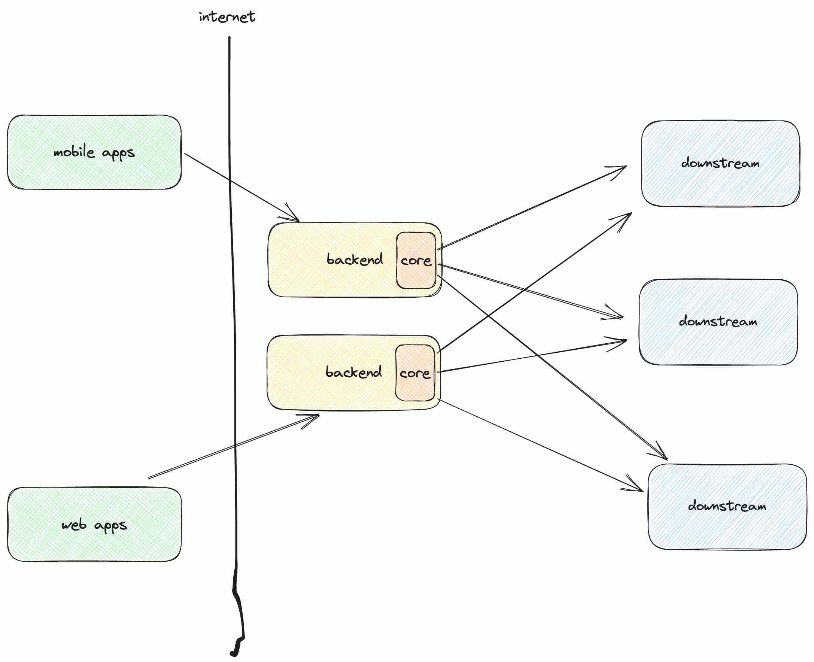

---
kind: blog
published: true
title: "Backend for Frontend, A Shade on Generic API"
date: 2023-08-27T01:10:25.00Z
path: /backend-for-frontend
tags:
  - software
  - design
  - architecture
  - bff
  - backend
  - frontend
description: There is a big desire to abstract servers in a general way, facilitating APIs to diverse client applications. This writing is not about gaslighting this particular API design, but it’s about seeing requirements from an alternate narrative.
cover: "./cover.jpg"
coverUrl: "https://unsplash.com/photos/busqfOj6i80?utm_source=guruhhapsara.dev"
coverAuthor: "archduk3"
coverOpacity: 0.5
---

Recently I worked on a feature analysis which as part of it involved mobile application source code inspection, and it reminds me of how incredibly intricate human front facing user interface is.

User Interface design and implementation has always been mental. What madness is not how to perfectly arrange modules, well abstract domains of concerns, nor establish predictable patterns, and so forth. Toolings and best practices are evolving, but it’s the complexity of crafting all moving interactions in frontend keeps advancing as the world demands more cool experiences.

Everytime I have a conversation about frontend development, it is staggering to notice how people are consistently concerned about how fragile user interface engineering implementation is in regard to the vast diverse end devices it needs to support.

As the old saying less code less problem, the question is how can we code less when the requirement is always more. What do we do, just give it up?

## Allegory

We all like dancing right? Let’s pick up a dance that has been celebrated for centuries exhibiting a rich culture and humility from the Republic of Dagestan Russia, named Lezginka. I encourage you to look it up on Youtube. Lezginka is performed by a man and a woman, where the woman would move swiftly from corner to corner and the man would circle around the woman, they both would dance without touching each other.

The man is often looking annoying to the woman, and I still think until now that the man should never be there. The man looks like a huge mistake where he would move his arms and feet in a weird way, he seems like a sliver to the dance complimented by the woman.

What the man does in Lezginka is not a mistake, if it’s a mistake, how can the rule last for hundreds of years, and it remains pure. The man and the woman get along to dance in harmony, speaking depth to our psyche. A form of art that animates unbounded time and space like that is not nothing, right.

What can we see from this great form of art. The push and pull dynamics are there, the concept should manifest all things including software engineering.

To recall our discussion, If frontend’s main job is to bring delicate user experience to end users, with regard to the set of preludes of adversity we talk about early, it seems it needs a pair for dance.

Backend is what remains in the stack, what would it make for frontend to achieve its goal.

## Preface

Usually we make our backend accessible as HTTP server to frontend via internet. Resource access is framed around HTTP verbs, computations and data are viable and exposed with designated endpoints which come along with specifications that frontend must adhere to.

All kinds of frontends will be given the same ways of requesting data and the same attributes of response data regardless of which data they are particularly interested in.

We don’t expect distinguished ways of communication given the runtime they are running on. Web browsers, Android, IOS, CLIs, and all other kinds are given the same ways of throwing requests and equivalent structures of response data. No variance, no distinguishable, all endpoints are dressing up in the same uniform looking even from any angles.

Let’s zoom into the server ecosystem for a moment, what are we doing with our servers in the current state of engineering design, we organize them as microservices.

What we attempt to achieve with microservice typically, we modularize business logics in self contained domains, we shift rapid changes, we manage to localize blast radius, things become less costly to replace, and so forth. As soon as we segregate or perhaps distribute responsibilities in several places, we would need to unite and coordinate these modular pieces in one place.

Not a comment on the gcloud API, this is only a prelude, a segue to the main interest we need to highlight. Say I want to have IP addresses whitelists from GCP load balancers in a single view. The first thing I do is to gcloud describe every forwarding rule to obtain target http proxy, then I would need to gcloud describe target http proxy instances to find their url map, and from url map I would fetch backend services, then I would need to fetch the detail of the security policy applied to backend services, then I could finally get the whitelisted IP addresses from the detail taken from the individual security policy. I have to go through several API calls to have data that I’m interested in.

This seems to be the case in a frontend application retrieving data from backend. How many microservices get in the way to provide mobile applications data to render a page, four, seven API calls. Then who does the coordination, juggling parameters from one to another, and sometimes does data processing for user interface purposes, who does all these sorts? That's frontend.

What’s wrong with this design? How can it be seen as a concern? Isn’t that what’s required?

## What BFF means

It seems to be difficult to find a solid definition of BFF. The only available Wikipedia pages don’t tell much about it. As I’m attempting to elaborate the details, things are not necessarily true, but I will wrestle with it as far as I can in this writing.

BFF stands for Backend for Frontend. What does it mean? It's never easy to understand what something is, but I think for most times it is reliable to start from motivation first hand.

If I frame how servers commonly provide APIs in a kind of screen direction, backend determines how things should be done, and how data should look like, and frontend becomes an active agent following determined specifications. If we think about who define the rules for a second, who’s actually being served?

BFF in comparison comes with a different intuition of API design approach to accommodate data exchange between server and client.

One of this software design pattern interests is to repress computation hefty taking place at the frontend side. To revisit the multi microservice orchestration calls case earlier, one of the things that BFF advocates is to offload non-exclusive API split calls away from clients, and authoring relevant data processing to servers. 

Think of BFF like kubernetes API server to kubectl. Let’s pull out one example of obtaining container metrics from kubernetes, instead of asking kubectl which is innocently a client in this case to call the kubelet metric endpoint from each node which is conspicuously the way prometheus node exporter does, kubernetes API server appoints metric server to do API orchestration and perform computation, it will then deliver container metrics data to kubectl.

BFF places one layer before data sources, BFF delegates backend to serve data interested by frontend. Let’s call these backend data sources downstream to minimize confusion.

Let’s manstraw this architecture design, delegating some region of frontend jobs to backend does not seem like an improvement right? Does it liberate us from writing business logics? Does it abdicate our responsibility to write tests? No.

Isn’t it just a source migration? The complex API labyrinth traversal is still there but now in a different place which also entails a new resource maintenance, complexity is not necessarily reduced, what’s the gain value?

## What’s the deal

As I’m getting used to working at the back side of things, servers, I start to lose a sense of an essential software engineering practice at the end user facing side, delivery. Recently I learnt an eye opening lesson about something very important in mobile application development.

Releasing code changes to backends has never been easier than nowadays. We have kubernetes which is one of the most if not the most valuable innovation in software engineering in the current decade. What kubernetes does to software release is fascinating, how much effort do we need to revert our changes in the backend at the period, one command line, that’s all.

Not only that, on the backend side, say a rollback is not enough, since we usually have other high risk activities like data patches, schema changes, and they often require manual hand interventions, a direct engagement to those processes on the server is feasible, we still have an opportunity to do it.

On the front side, mobile applications do not have that level of freedom. Once changes are rolled out to application stores, they become available to end users. Pulling back changes in applications installed in user end devices is not manageable. Though a practice like feature toggle is viable, is it elegant to feature toggle every change.

The essence of rollback in mobile applications is a whole different game, once changes are deployed, they are irreversible.
Calling back on the advantage of rollback we have in backend, moving source code to backend means we will have the benefits of server infrastructure which emulates the hard problem of mobile application release.

Now reverting updates on business logics that are resistant to change easily on mobile applications become feasible in operations. They are no longer imprisoned in mobile application release glass ceilings.

Let’s dial in another daunting thing in software engineering, orchestration, though it may be virtually all things in computer programs about right, we integrate camera, geolocation, server, database, filesystem, network, graphics, everything is API.

Nevertheless assembling multiple things with minimum contexts of one another is susceptible to unexpected results as distant things are usually complex to coordinate. Having an integration involving phone call and motion gesture APIs processed on mobile applications should be the sanest as there’s more context the app has than other places.

Another instance of BFF concerns is the use of frontend in exchanging data with varied sources. There will be essentially contacts performed to distant places.

The farther the lesser opportunity of being with enriched information. If this is true, then mingling APIs from a bunch of servers doesn’t seem to belong at the frontend side.

Once again the benefit of having backend for this, they can coordinate under close environments, they will have more information as more data sources become reachable.

Moreover, we have an ability to scale our computations in and out both sufficiently and conditionally given the luxury of server infrastructure. More variables are under our feet.

What source code migration promises is not as mundane as it sounds, but this should be context appropriate, since there are other billions determining factors in decision making whereas efforts and returns are in the hands of the holders.

## Where can it go

One thing to emphasize is that BFF is expected to serve the end user experience. What does that mean? Different looks come with different requirements, necessitating a dedicated stack. One backend belongs to one frontend where each instance works independently.

Where does this architecture lead to? Multiplying the amount of backend in order to serve different experiences of frontend unseals the chance of code repetition, redundant implementations, leading to inefficient, prone to inconsistent work of engineering.

Replacing a well existing battle tested design sounds implausible. The generic API multi purpose backend keeps proclaiming its prominent benefits.

This particular concern portrays that there’s a strong need for generic API, a sense to bring a general abstraction to different types of consumer remains relevant to BFF architecture.

Considering the benefit of generic API design, reintroducing the generic API in the BFF architecture seems reasonable given the set of conditions taking place at the backend.

The main interest of adoption is to centralize business logic which takes care of API orchestrations needed for data enquiry. Bringing a new component in the architecture stack also means that backend can now be reserved for individual frontend experience.

Remember API is not always servers made available through HTTP, they could be modules, device interfaces, or any other forms. The key is enabling. In our attempt to exhaust the benefits of backend, it has to be something powered by server infrastructure.

The decision we make to determine the instrument of the core part is an interesting topic to discuss. HTTP server seems to be a favorable choice, but let’s try to have a look at an alternative which seems to peddle an interesting offering.

Instead of having the core as a server, let’s bring it closer to the backends. This can be achieved by a shared library, writing core functionalities in a binary source code built it right into backend process.

This would seem to cut off network trips from the data access chain, but it would work best on a stateless process, what it does is only to proxy requests to downstream and there are perhaps some immutable functions for computations. If these are all on check, having a shared library may be a desirable choice.

It comes with a cost too. In a condition where there are backends maintained by different teams, we would be less likely to see a same equal version of package deployed to interface with the core functionalities in individual backends.

This varying build circumstance in some extent becomes a burden in which the maintenance of multiple versions must be held accountable.

HTTP server doesn’t seem to suffer this kind of drudgery. Severs run with one version at a time. If there’s a need to stretch servers to be stratified, we could do it right from endpoints, a practice we do in providing generic API.

Regardless of how we creatively form BFF implementation, the vantage point is to provide downstream orchestrations API and designated backend for frontend experience aiming at reliable, consistent and reusable components at work.
